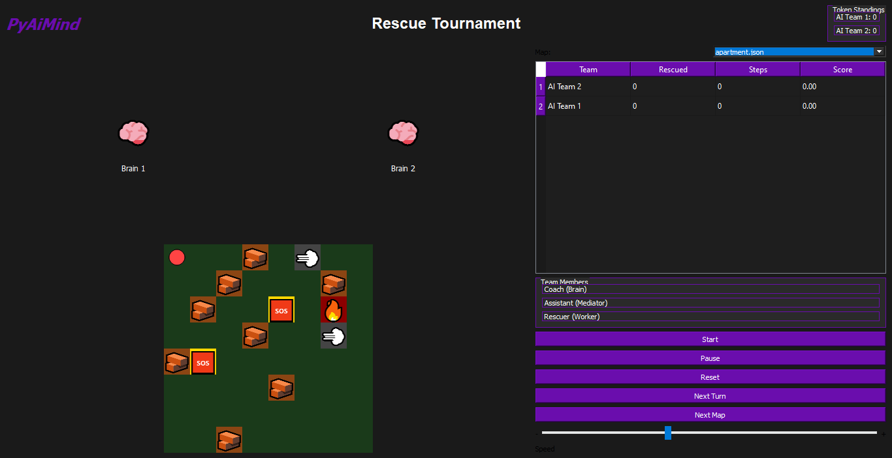
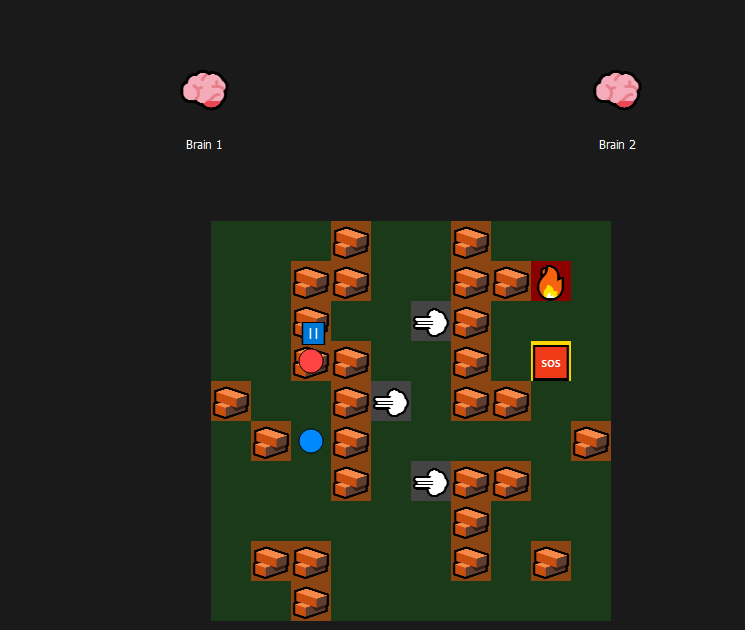
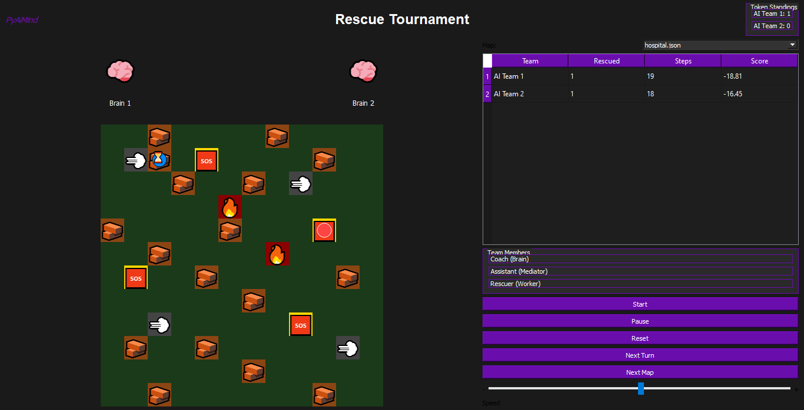
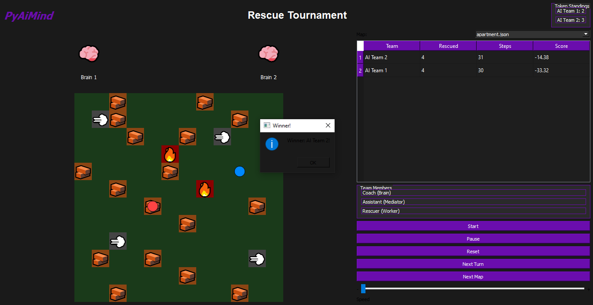

# 🏆 RACE v2.0 – AI Rescue Tournament

**An AI competition platform where teams of intelligent agents learn, adapt, and race to rescue trapped people in disaster simulations.**

   -orange)

---

## 🎯 Motivation

This project was created to explore **multi-agent systems** in a competitive setting. Instead of using a single general-purpose AI, the system uses multiple specialized agents that must work together as a team while competing against other teams to achieve a shared goal.

The core idea is to investigate how competition between intelligent agents can lead to better decision-making and emergent strategies — a concept that is becoming increasingly important in modern AI research and applications.

---

## 🧠 What's New in v2.0 (The "Smart Brain" Update)

This version replaces the old rule-based AI with a **Hybrid Intelligence** system:

- **Q-Learning Agent:** The brain now learns which target to rescue first. It stores its knowledge in a Q-table that persists across program restarts.
- **BFS Path Planner:** Once a target is chosen, the shortest safe path is calculated instantly (no more wandering around).
- **Shared Competition Map:** Both teams now race on the same physical map. A rescued target disappears for everyone – the race is truly competitive.
- **Memory that Lasts:** After the program closes, the AI remembers its training. The next time you run it, it's already an expert.

---

## 📸 Screenshots






---

## 🤖 How Each Team Works (The Trinity)

| Agent | Role |
|:---|:---|
| 🧠 **Brain** | Strategic commander. Uses Q-Learning to pick the best target, then BFS to plan the route. Learns from every mistake. |
| 📡 **Mediator** | Translator. Converts high-level commands ("Go to Person A") into step-by-step moves (UP, DOWN, LEFT, RIGHT). |
| 🚑 **Worker** | Field agent. Moves on the grid, gets stuck in rubble, respawns from fire, and rescues people. |

> **Golden Rule:** The Worker never decides. The Mediator never plans. The Brain never moves.

---

## 🌍 Maps & Obstacles

Three realistic disaster maps, stored as JSON:

| Map | Size | Theme |
|:---|:---|:---|
| 🏠 Apartment | 8×8 | Collapsed residential unit |
| 🏥 Hospital | 10×10 | Damaged medical facility |
| 🚇 Metro | 12×12 | Collapsed subway station |

**Obstacles with consequences:**
- 🪨 **Rubble (1):** Stops the worker for 3 turns (teaches the brain to avoid it).
- 🔥 **Fire (2):** If entered, the worker respawns at the start.
- 💨 **Smoke (3):** Limits vision, but doesn't block.
- 🆘 **Trapped Person (4):** The objective. First team to reach it claims the rescue.

---

## 🏁 Competition Rules

- **Turn-Based:** Teams alternate moves like chess.
- **Shared Resources:** Once a target is rescued, it disappears from the map for everyone.
- **Instant Victory:** The race ends the moment the last target is rescued.
- **Scoring:** `Score = (rescues × 10) – (steps) – (wasted steps × 0.5)`
- **Tournament Mode:** Three maps played sequentially. Each victory gives +1 Token. Most tokens wins the championship.

---

## ⚡ Key AI Features

- **Experience-Based Learning:** The Q-table improves over time. After 50 pretraining episodes (≈5 seconds on first launch), the AI makes smart decisions.
- **Risk-Aware Pathfinding:** BFS avoids fire by default, but the brain can choose a risky route if it's the only option.
- **Persistent Memory:** Q-tables are saved as JSON files in the `q_tables/` folder. Delete them to reset the AI's brain to zero.

---

## 🚧 Challenges & Learnings

- **Integrating Reinforcement Learning into an existing architecture**: The main challenge was adding Q-Learning without breaking the three-layer structure (Brain–Mediator–Worker). The solution was to limit Q-Learning to target selection only, while keeping BFS for path planning. This hybrid approach proved more effective than using either method alone.
  
- **Shared environment synchronization**: Ensuring that both teams see real-time updates on the map (such as a rescued target disappearing) required careful design of the `RaceManager`. This taught the importance of having a single source of truth in multi-agent systems.

- **Cold start problem**: In early versions, agents performed randomly in the first matches. Running 50 silent pretraining episodes before the actual game significantly improved their initial performance and made them strategically competitive from the start.

- **Persistent memory**: Saving and loading Q-tables as JSON files allowed agents to retain knowledge across different sessions. This simple implementation introduced the concept of lifelong learning in a practical way.

---

## 💡 From v1 to v2 – The Evolution

| Version | Brain                    | Behavior                              |
|---------|--------------------------|---------------------------------------|
| v1.0    | Rule-based + Random      | Unpredictable and often ineffective   |
| v2.0    | Q-Learning + BFS         | Learns from experience and competes strategically |

The shift from a simple rule-based system to a hybrid reinforcement learning approach significantly improved the agents' decision-making and adaptability.

---

## 🚀 Quick Start

```bash
pip install PyQt5
python Main.py
```

Controls: Start, Pause, Reset, Next Turn, Next Map, and a Speed Slider.

---

## 📁 Project Structure

```
Race_tournament/
├── Main.py               # Entry point
├── gui.py                # PyQt5 interface (purple theme, shared grid)
├── brain.py              # Hybrid AI (Q-Learning + BFS)
├── worker.py             # Field agent
├── mediator.py           # Command translator
├── team.py               # Team wrapper with pretraining
├── race_manager.py       # Turn manager & referee (shared grid)
├── tournament.py         # Multi-map championship
├── map_loader.py         # JSON map loader
├── Maps/                 # apartment.json, hospital.json, metro.json
├── Tests/                # Test scripts
├── screenshots/          # Project screenshots
└── q_tables/             # Saved AI brains (JSON)
```

---

## 🧪 Running Tests

Test files are in the Tests/ folder. To run one, copy it to the root and execute:

```bash
cp Tests/test_worker_v2.py .
python test_worker_v2.py
```

---

## 🛠️ Built With

· Python 3.8+
· PyQt5 (GUI)
· BFS Algorithm (pathfinding)
· Q-Learning (reinforcement learning)
· JSON (maps & data storage)

---

## 🔬 Technical Deep Dive

For a detailed explanation of state representation, reward function design, and the Q-Learning implementation, see TECHNICAL.md.

---

## 📄 License

This project is licensed under the MIT License.
See the LICENSE file for the full legal text.
You are free to use, modify, and share this project for any purpose.

---

## 👤 Author

Ali Valizadeh (PyAiMind)
AI Architect & Developer
Born: 2 Nov 2009

```
